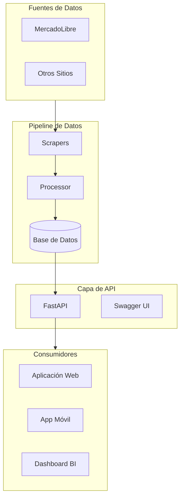
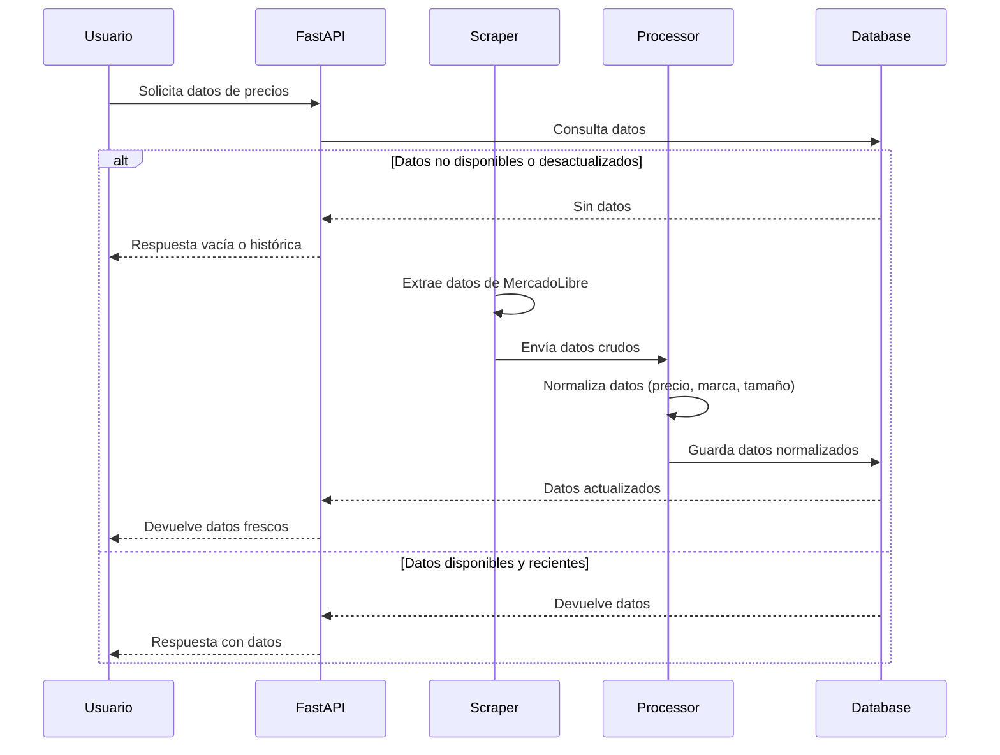

# CHValueGrowth

> **Sistema de Inteligencia de Mercado para Monitoreo de Precios de Llantas**

<p align="center">
  
  
  
  
</p>

---

## 📋 Descripción Ejecutiva

**CHValueGrowth** es una plataforma de inteligencia de mercado diseñada para monitorear, analizar y optimizar estrategias de precios en el sector de neumáticos en México.

### Problema que Resuelve

* Monitoreo de precios de múltiples proveedores en tiempo real
* Identificación de oportunidades de compra y competencia
* Decisiones basadas en datos actualizados del mercado

### Solución Propuesta

Un sistema automatizado que extrae datos de precios de múltiples fuentes, los normaliza y los presenta a través de una API RESTful, permitiendo a las empresas tomar decisiones informadas.

---

## 🏗️ Arquitectura del Sistema



### Componentes del Sistema

| Componente | Descripción                             | Tecnología               |
| ---------- | --------------------------------------- | ------------------------ |
| Scrapers   | Extracción de datos de fuentes externas | requests, BeautifulSoup4 |
| Processor  | Normalización y limpieza de datos       | Python, Pandas           |
| API        | Interfaz REST para consumo de datos     | FastAPI, Uvicorn         |
| Database   | Almacenamiento persistente              | SQLAlchemy, PostgreSQL   |

---

## 🔄 Flujo de Datos



---

## 🛠️ Stack Tecnológico

| Capa         | Tecnología     | Versión |
| ------------ | -------------- | ------- |
| Lenguaje     | Python         | 3.14+   |
| API          | FastAPI        | 0.109+  |
| Servidor     | Uvicorn        | Latest  |
| Scraping     | requests       | Latest  |
| HTML Parsing | BeautifulSoup4 | Latest  |
| Datos        | Pandas         | Latest  |
| ORM          | SQLAlchemy     | Latest  |
| Config       | python-dotenv  | Latest  |

---

## 📦 Estructura del Proyecto

```
Desarrollo_chvaluegrowth/
├── configs/                  
├── database/                 
├── scripts/                  
│   └── run_scraper.py        
├── services/
│   ├── api/                  
│   │   ├── main.py          
│   │   └── routes/          
│   ├── processor/           
│   │   ├── normalizer/      
│   │   └── matcher/         
│   ├── scheduler/            
│   └── scrapers/            
│       ├── common/          
│       └── mercadolibre/    
├── tests/                    
├── .env.example              
├── requirements.txt          
└── README.md                 
```

---

## 💡 Casos de Uso

### 1. Monitoreo de Precios Competitivos

```json
{
  "products": [
    {
      "title": "Llanta Michelin Primacy 4 205/55 R16",
      "price": 2450.00,
      "source": "mercadolibre",
      "timestamp": "2026-03-27T10:00:00Z"
    }
  ]
}
```

### 2. Análisis de Tendencias

```json
{
  "period": "last_30_days",
  "average_price": 2200.00,
  "min_price": 1890.00,
  "max_price": 2800.00,
  "trend": "stable"
}
```

### 3. Alertas de Precio

```json
{
  "product": "llanta 195/65R15",
  "max_price": 1500.00,
  "email": "usuario@empresa.com"
}
```

---

## 🚀 Roadmap (Sprints)

| Sprint | Nombre              | Objetivo                            | Estado       |
| ------ | ------------------- | ----------------------------------- | ------------ |
| 1      | Base sólida         | API funcional con /health           | ✅ Completado |
| 2      | Scraper funcional   | Extracción de datos de MercadoLibre | ✅ Completado |
| 3      | Pipeline de datos   | Normalización y limpieza de datos   | ✅ Completado |
| 4      | Endpoints básicos   | /products, /stats, /grouped         | ✅ Completado |
| 5      | Base de datos       | SQLite, CRUD                        | ✅ Completado |
| 6      | Dashboard UI        | Dashboard HTML con Chart.js         | ✅ Completado |
| 7      | Docker + Deployment | Contenedor para Render              | ✅ Completado |

---

## 🧱 Modelo de Datos

```json
{
  "source": "mercadolibre",
  "title": "Llanta Michelin Primacy 4 205/55 R16",
  "brand": "Michelin",
  "size": "205/55R16",
  "price": 2450.00,
  "currency": "MXN",
  "url": "https://...",
  "scraped_at": "2026-03-27T10:00:00Z"
}
```

### Campos del Modelo

| Campo      | Tipo     | Descripción                  |
| ---------- | -------- | ---------------------------- |
| source     | string   | Fuente de datos              |
| title      | string   | Título original del producto |
| brand      | string   | Marca extraída               |
| size       | string   | Medida del neumático         |
| price      | float    | Precio en MXN                |
| currency   | string   | Moneda                       |
| url        | string   | URL del producto             |
| scraped_at | datetime | Timestamp de extracción      |

---

## ⚠️ Limitaciones Actuales

* Render Free hiberna después de 15 minutos
* Base de datos SQLite se resetea en cada deployment
* Scraper en modo MOCK por defecto (configurable via .env)

---

## 🎯 Métricas de Éxito (KPIs)

| Métrica                  | Descripción                             | Objetivo     |
| ------------------------ | --------------------------------------- | ------------ |
| Precisión de matching    | % productos correctamente identificados | > 90%        |
| Latencia de scraping     | Tiempo promedio de extracción           | < 5s         |
| Actualización de precios | Frecuencia de actualización de datos    | Cada 6 horas |
| Cobertura de mercado     | % fuentes monitoreadas vs objetivo      | > 80%        |

---

## 📝 Ejemplo de Respuesta de API

### Health Check

```json
{
  "status": "healthy",
  "service": "api",
  "project": "CHValueGrowth",
  "version": "1.0.0",
  "timestamp": "2026-03-27T01:20:29.706827Z"
}
```

### Raíz

```json
{
  "status": "ok",
  "project": "CHValueGrowth"
}
```

---

## 🏃‍♂️ Cómo Ejecutar el Proyecto

### Prerrequisitos

* Python 3.14+
* pip

### Instalación

```bash
cd Desarrollo_chvaluegrowth
python -m venv venv
source venv/bin/activate
pip install -r requirements.txt
cp .env.example .env
```

### Iniciar la API

```bash
uvicorn services.api.main:app --reload
# Producción
uvicorn services.api.main:app --host 0.0.0.0 --port 8000
```

### Documentación

* Swagger UI: [http://localhost:8000/docs](http://localhost:8000/docs)
* ReDoc: [http://localhost:8000/redoc](http://localhost:8000/redoc)

---

## ☁️ Deployment a Render.com

* Configuración lista con `render.yaml`
* URLs:

  * API: `https://chvaluegrowth-api.onrender.com`
  * Health: `https://chvaluegrowth-api.onrender.com/health`
  * Dashboard: `https://chvaluegrowth-api.onrender.com/dashboard`
  * Swagger: `https://chvaluegrowth-api.onrender.com/docs`

---

## 🤝 Contribuciones

1. Fork del repositorio
2. Crear branch feature
3. Commit & Push
4. Pull Request

---

## 📄 Licencia

MIT License


## 📧 Contacto

Equipo de desarrollo

*Última actualización: 27/03/2026*

