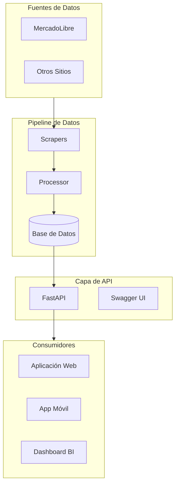
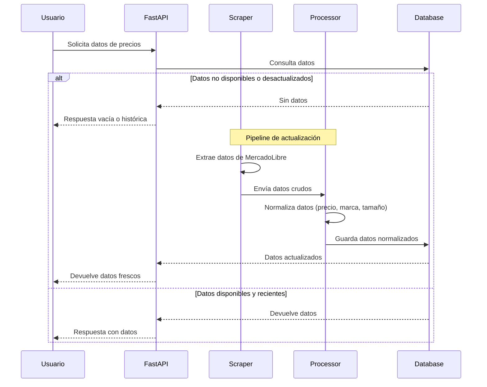

# CHValueGrowth

> **Sistema de Inteligencia de Mercado para Monitoreo de Precios de Llantas**

<p align="center">
  
  
  
  
</p>

---

## 📋 Descripción Ejecutiva

**CHValueGrowth** es una plataforma de inteligencia de mercado diseñada para monitorear, analizar y optimizar estrategias de precios en el sector de neumáticos en México.

### Problema que Resuelve

Las empresas del sector de llantas enfrentan dificultades para:
- **Monitorear precios** de múltiples proveedores en tiempo real
- **Identificar oportunidades** de compra y competencia
- **Tomar decisiones** basadas en datos actualizados del mercado

### Solución Propuesta

Un sistema automatizado que extrae datos de precios de múltiples fuentes, los normaliza y los presenta a través de una API RESTful, permitiendo a las empresas tomar decisiones informadas.

---

## 🏗️ Arquitectura del Sistema



### Componentes del Sistema

| Componente | Descripción | Tecnología |
|------------|-------------|------------|
| **Scrapers** | Extracción de datos de fuentes externas | requests, BeautifulSoup4 |
| **Processor** | Normalización y limpieza de datos | Python, Pandas |
| **API** | Interfaz REST para consumo de datos | FastAPI, Uvicorn |
| **Database** | (Planeado) Almacenamiento persistente | SQLAlchemy, PostgreSQL |

---

## 🔄 Flujo de Datos



---

## 🛠️ Stack Tecnológico

| Capa | Tecnología | Versión |
|------|------------|---------|
| **Lenguaje** | Python | 3.14+ |
| **API** | FastAPI | 0.109+ |
| **Servidor** | Uvicorn | Latest |
| **Scraping** | requests | Latest |
| **HTML Parsing** | BeautifulSoup4 | Latest |
| **Datos** | Pandas | Latest |
| **ORM** | SQLAlchemy | Latest |
| **Config** | python-dotenv | Latest |

---

## 📦 Estructura del Proyecto

```
Desarrollo_chvaluegrowth/
├── configs/                  # Configuraciones del sistema
├── database/                 # Modelos y esquemas de BD
├── scripts/                  # Scripts de ejecución
│   └── run_scraper.py        # Ejecutor de scrapers
├── services/
│   ├── api/                  # Servidor FastAPI
│   │   ├── main.py          # Punto de entrada
│   │   └── routes/          # Endpoints
│   ├── processor/           # Procesamiento de datos
│   │   ├── normalizer/      # Normalización
│   │   └── matcher/         # Matching de productos
│   ├── scheduler/            # Tareas programadas
│   └── scrapers/            # Módulos de scraping
│       ├── common/          # Funciones comunes
│       └── mercadolibre/    # Scraper de MercadoLibre
├── tests/                    # Pruebas unitarias
├── .env.example              # Variables de entorno
├── requirements.txt          # Dependencias
└── README.md                 # Este archivo
```

---

## 💡 Casos de Uso

### 1. Monitoreo de Precios Competitivos
```json
// GET /api/v1/prices?brand=Michelin&size=205/55R16
{
  "products": [
    {
      "title": "Llanta Michelin Primacy 4 205/55 R16",
      "price": 2450.00,
      "source": "mercadolibre",
      "timestamp": "2026-03-27T10:00:00Z"
    }
  ]
}
```

### 2. Análisis de Tendencias
```json
// GET /api/v1/analytics/trends?product=llanta205
{
  "period": "last_30_days",
  "average_price": 2200.00,
  "min_price": 1890.00,
  "max_price": 2800.00,
  "trend": "stable"
}
```

### 3. Alertas de Precio
```json
// POST /api/v1/alerts
{
  "product": "llanta 195/65R15",
  "max_price": 1500.00,
  "email": "usuario@empresa.com"
}
```

---

## 🚀 Roadmap (Sprints)

Basado en [`sprints.yaml`](sprints.yaml):

| Sprint | Nombre | Objetivo | Estado |
|--------|--------|----------|--------|
| **1** | Base sólida del proyecto | API funcional con /health | ✅ Completado |
| **2** | Scraper funcional | Extracción de datos de MercadoLibre | 🔄 En progreso |
| **3** | Pipeline de datos | Normalización y limpieza de datos | ⏳ Pendiente |
| **4** | Endpoints avanzados | Búsqueda, filtros, analytics | ⏳ Pendiente |
| **5** | Base de datos | Persistencia con PostgreSQL | ⏳ Pendiente |
| **6** | Dashboard | Interfaz de visualización de datos | ⏳ Pendiente |

---

## 📊 Decisiones Técnicas

### ¿Por qué FastAPI?
- **Documentación automática** con Swagger UI
- **Alto rendimiento** comparable con Node.js
- **Tipado estático** con Pydantic
- **Async-first** para mayor concurrencia

### ¿Por qué esta estructura?
```
services/
├── api/        # Separación clara de responsabilidades
├── processor/  # Facilita testing independiente
├── scrapers/   # Permite agregar nuevas fuentes sin modificar lógica
└── scheduler/  # Preparado para tareas cron
```

### ¿Por qué Pandas para procesamiento?
- Manipulación de datos eficiente
- Integración nativa con numpy
- Funciones de limpieza incorporadas

---

## 🧱 Modelo de Datos (Draft)

```json
{
  "source": "mercadolibre",
  "title": "Llanta Michelin Primacy 4 205/55 R16",
  "brand": "Michelin",
  "size": "205/55R16",
  "price": 2450.00,
  "currency": "MXN",
  "url": "https://...",
  "scraped_at": "2026-03-27T10:00:00Z"
}
```

### Campos del Modelo

| Campo | Tipo | Descripción |
|-------|------|-------------|
| `source` | string | Fuente de datos (mercadolibre, etc) |
| `title` | string | Título original del producto |
| `brand` | string | Marca extraída (Michelin, Bridgestone, etc) |
| `size` | string | Medida del neumático (205/55R16) |
| `price` | float | Precio en MXN |
| `currency` | string | Moneda (MXN) |
| `url` | string | URL del producto |
| `scraped_at` | datetime | Timestamp de extracción |

---

## ⚠️ Limitaciones Actuales

- Scraper aún no implementado completamente
- No hay persistencia en base de datos
- No hay deduplicación de productos
- No hay manejo de anti-bot / rate limiting
- Solo endpoint /health disponible

---

## 🎯 Métricas de Éxito (KPIs)

| Métrica | Descripción | Objetivo |
|---------|-------------|----------|
| Precisión de matching | % productos correctamente identificados | > 90% |
| Latencia de scraping | Tiempo promedio de extracción | < 5s |
| Actualización de precios | Frecuencia de actualización de datos | Cada 6 horas |
| Cobertura de mercado | % fuentes monitoreadas vs objetivo | > 80% |

---

## 📝 Ejemplo de Respuesta de API

### Health Check
```json
// GET http://localhost:8000/health
{
  "status": "healthy",
  "service": "api",
  "project": "CHValueGrowth",
  "version": "1.0.0",
  "timestamp": "2026-03-27T01:20:29.706827Z"
}
```

### Raíz
```json
// GET http://localhost:8000/
{
  "status": "ok",
  "project": "CHValueGrowth"
}
```

---

## 🏃‍♂️ Cómo Ejecutar el Proyecto

### Prerrequisitos
- Python 3.14+
- pip (gestor de paquetes)

### Instalación

```bash
# 1. Clonar o extraer el proyecto
cd Desarrollo_chvaluegrowth

# 2. Crear entorno virtual (recomendado)
python -m venv venv
source venv/bin/activate  # Linux/Mac
# En Windows: venv\Scripts\activate

# 3. Instalar dependencias
pip install -r requirements.txt

# 4. Configurar variables de entorno
cp .env.example .env
# Editar .env con tu configuración
```

### Iniciar la API

```bash
# Modo desarrollo con reload automático
uvicorn services.api.main:app --reload

# Modo producción
uvicorn services.api.main:app --host 0.0.0.0 --port 8000
```

### Acceder a la Documentación

- **Swagger UI**: http://localhost:8000/docs
- **ReDoc**: http://localhost:8000/redoc

---

## ☁️ Deployment a Render.com

Este proyecto está configurado para deploy automático en [Render.com](https://render.com) usando contenedores Docker.

### Requisitos

1. Cuenta en [Render.com](https://render.com)
2. Repositorio en [GitHub](https://github.com) con el proyecto

### Pasos para Deployment

1. **Subir proyecto a GitHub**
   ```bash
   # Crear repositorio en GitHub y seguir las instrucciones
   git init
git add .
git commit -m "Initial commit: CHValueGrowth API"
   git branch -M main
git remote add origin https://github.com/TU_USUARIO/TU_REPO.git
   git push -u origin main
   ```

2. **Conectar GitHub a Render**
   - Iniciar sesión en [Render.com](https://render.com)
   - Ir a "New" → "Web Service"
   - Seleccionar el repositorio de GitHub
   - Render detectará automáticamente el `Dockerfile`

3. **Configuración en Render**
   - **Name**: `chvaluegrowth-api`
   - **Environment**: Docker
   - **Region**: Oregon (o la más cercana)
   - **Plan**: Free

4. **Variables de Entorno** (opcional, ya configuradas en render.yaml)
   - `MOCK_MODE`: `true`
   - `DATABASE_URL`: `sqlite:///chvaluegrowth.db`

5. **Deploy**
   - Click en "Create Web Service"
   - Render construirá la imagen Docker automáticamente
   - La API estará disponible en la URL asignada

### URLs después del deployment

- **API**: `https://chvaluegrowth-api.onrender.com`
- **Health**: `https://chvaluegrowth-api.onrender.com/health`
- **Dashboard**: `https://chvaluegrowth-api.onrender.com/dashboard`
- **Swagger**: `https://chvaluegrowth-api.onrender.com/docs`

### Archivo de Configuración

El archivo [`render.yaml`](render.yaml) define la configuración del servicio. Render lo detectará automáticamente.

### Nota Importante

- El plan **Free** de Render hiberna después de 15 minutos de inactividad
- La primera solicitud después de hibernación puede tomar ~30 segundos
- Para evitar hibernación, considera el planpaid

---

## 🤝 Contribuciones

El proyecto está en desarrollo activo. Para contribuciones:

1. Fork del repositorio
2. Crear branch feature: `git checkout -b feature/nueva-funcionalidad`
3. Commit cambios: `git commit -m 'Agrega nueva funcionalidad'`
4. Push al branch: `git push origin feature/nueva-funcionalidad`
5. Crear Pull Request

---

## 📄 Licencia

MIT License - Consulta el archivo LICENSE para más detalles.

---

## 📧 Contacto

Para preguntas o soporte, contacta al equipo de desarrollo.

---

*Última actualización: 27/03/2026*
