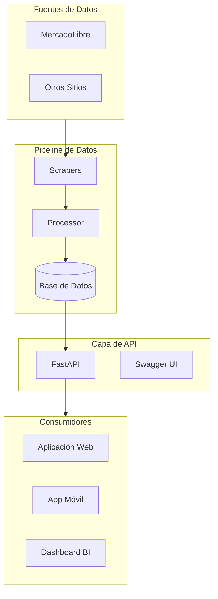
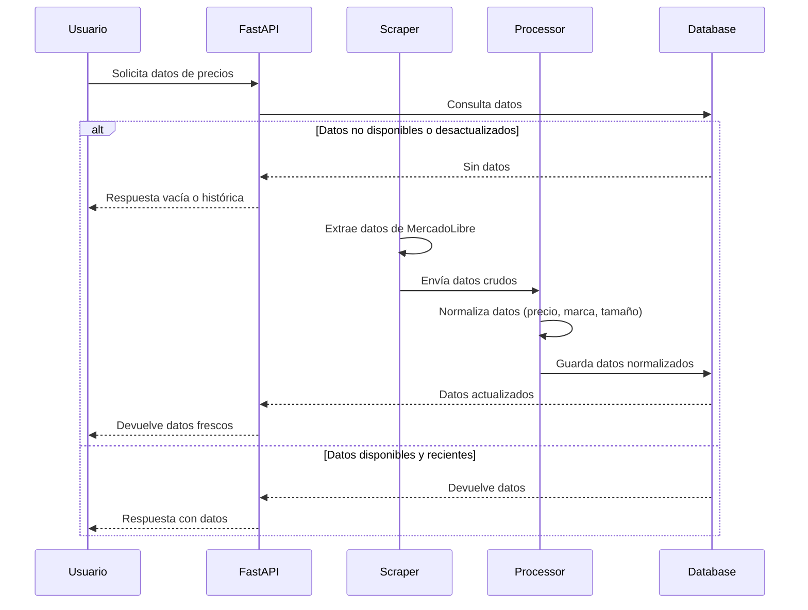

# NeumatiQ

> **Sistema de Gestión Integral para el Comercio de Neumáticos**
> Desarrollado por GProA Technology | Comercializado por CH ValueGrowth

<p align="center">
  
  
  
  
</p>

---

## 📋 Descripción Ejecutiva

**NeumatiQ** es un sistema de gestión integral diseñado específicamente para la gestión y compra del comercio de neumáticos (llantas). Cubre todos los procesos del negocio: compras a proveedores, inventario, ventas, facturación, control de bodega, gestión de clientes, reportes financieros, análisis de margen, rotación de productos, alertas de stock, CRM, etc.

### Problema que Resuelve

* Gestión integral de neumáticos (inventario, ventas, facturación)
* Control de bodega y proveedores
* Análisis de márgenes y rentabilidad
* CRM y gestión de clientes
* Reportes financieros y KPIs

### Solución Propuesta

Una plataforma integral que automatiza todos los procesos del negocio de neumáticos, desde la compra a proveedores hasta la facturación y análisis de ventas.

---

## 🏗️ Arquitectura del Sistema


```mermaid
flowchart TB
    subgraph Fuentes["Fuentes de Datos"]
        ML[MercadoLibre]
        OT[Otros Sitios]
    end

    subgraph Pipeline["Pipeline de Datos"]
        SC[Scrapers]
        PR[Processor]
        DB[(Base de Datos)]
    end

    subgraph API["Capa de API"]
        FA[FastAPI]
        SW[Swagger UI]
    end

    subgraph Consumidores["Consumidores"]
        WEB[Aplicación Web]
        MOV[App Móvil]
        BI[Dashboard BI]
    end

    Fuentes --> SC
    SC --> PR
    PR --> DB
    DB --> FA
    FA --> Consumidores
```

### Componentes del Sistema

| Componente | Descripción                             | Tecnología               |
| ---------- | --------------------------------------- | ------------------------ |
| Scrapers   | Extracción de datos de fuentes externas | requests, BeautifulSoup4 |
| Processor  | Normalización y limpieza de datos       | Python, Pandas           |
| API        | Interfaz REST para consumo de datos     | FastAPI, Uvicorn         |
| Database   | Almacenamiento persistente              | SQLAlchemy, PostgreSQL   |

---

## 🔄 Flujo de Datos


```mermaid
sequenceDiagram
    participant U as Usuario
    participant API as FastAPI
    participant SC as Scraper
    participant PR as Processor
    participant DB as Database

    U->>API: Solicita datos de precios
    API->>DB: Consulta datos
    
    alt Datos no disponibles o desactualizados
        DB-->>API: Sin datos
        API-->>U: Respuesta vacía o histórica
        SC->>SC: Extrae datos de MercadoLibre
        SC->>PR: Envía datos crudos
        PR->>PR: Normaliza datos (precio, marca, tamaño)
        PR->>DB: Guarda datos normalizados
        DB-->>API: Datos actualizados
        API-->>U: Devuelve datos frescos
    else Datos disponibles y recientes
        DB-->>API: Devuelve datos
        API-->>U: Respuesta con datos
    end
```

---

## 🛠️ Stack Tecnológico

| Capa         | Tecnología     | Versión |
| ------------ | -------------- | ------- |
| Lenguaje     | Python         | 3.14+   |
| API          | FastAPI        | 0.109+  |
| Servidor     | Uvicorn        | Latest  |
| Scraping     | requests       | Latest  |
| HTML Parsing | BeautifulSoup4 | Latest  |
| Datos        | Pandas         | Latest  |
| ORM          | SQLAlchemy     | Latest  |
| Config       | python-dotenv  | Latest  |

---

## 📦 Estructura del Proyecto

```
GProA_CHValueGrowth/
├── configs/
├── database/
├── scripts/
│   └── run_scraper.py
├── services/
│   ├── api/
│   │   ├── main.py
│   │   └── routes/
│   ├── processor/
│   │   ├── normalizer/
│   │   └── matcher/
│   ├── scheduler/
│   └── scrapers/
│       ├── common/
│       └── mercadolibre/
├── frontend/
│   ├── src/
│   │   ├── components/
│   │   ├── pages/
│   │   └── App.jsx
│   ├── package.json
│   └── vite.config.js
├── tests/
├── .env.example
├── requirements.txt
└── README.md
```

---

## 💡 Casos de Uso

### 1. Monitoreo de Precios Competitivos

```json
{
  "products": [
    {
      "title": "Llanta Michelin Primacy 4 205/55 R16",
      "price": 2450.00,
      "source": "mercadolibre",
      "timestamp": "2026-03-27T10:00:00Z"
    }
  ]
}
```

### 2. Análisis de Tendencias

```json
{
  "period": "last_30_days",
  "average_price": 2200.00,
  "min_price": 1890.00,
  "max_price": 2800.00,
  "trend": "stable"
}
```

### 3. Alertas de Precio

```json
{
  "product": "llanta 195/65R15",
  "max_price": 1500.00,
  "email": "usuario@empresa.com"
}
```

---

## 🚀 Roadmap (Sprints)

| Sprint | Nombre              | Objetivo                            | Estado       |
| ------ | ------------------- | ----------------------------------- | ------------ |
| 1      | Base sólida         | API funcional con /health           | ✅ Completado |
| 2      | Scraper funcional   | Extracción de datos de MercadoLibre | ✅ Completado |
| 3      | Pipeline de datos   | Normalización y limpieza de datos   | ✅ Completado |
| 4      | Endpoints básicos   | /products, /stats, /grouped         | ✅ Completado |
| 5      | Base de datos       | SQLite, CRUD                        | ✅ Completado |
| 6      | Dashboard UI        | Dashboard HTML con Chart.js         | ✅ Completado |
| 7      | Docker + Deployment | Contenedor para Render              | ✅ Completado |

---

## 🧱 Modelo de Datos

```json
{
  "source": "mercadolibre",
  "title": "Llanta Michelin Primacy 4 205/55 R16",
  "brand": "Michelin",
  "size": "205/55R16",
  "price": 2450.00,
  "currency": "MXN",
  "url": "https://...",
  "scraped_at": "2026-03-27T10:00:00Z"
}
```

### Campos del Modelo

| Campo      | Tipo     | Descripción                  |
| ---------- | -------- | ---------------------------- |
| source     | string   | Fuente de datos              |
| title      | string   | Título original del producto |
| brand      | string   | Marca extraída               |
| size       | string   | Medida del neumático         |
| price      | float    | Precio en MXN                |
| currency   | string   | Moneda                       |
| url        | string   | URL del producto             |
| scraped_at | datetime | Timestamp de extracción      |

---

## ⚠️ Limitaciones Actuales

* Render Free hiberna después de 15 minutos
* Base de datos SQLite se resetea en cada deployment
* Scraper en modo MOCK por defecto (configurable via .env)

---

## 🎯 Métricas de Éxito (KPIs)

| Métrica                  | Descripción                             | Objetivo     |
| ------------------------ | --------------------------------------- | ------------ |
| Precisión de matching    | % productos correctamente identificados | > 90%        |
| Latencia de scraping     | Tiempo promedio de extracción           | < 5s         |
| Actualización de precios | Frecuencia de actualización de datos    | Cada 6 horas |
| Cobertura de mercado     | % fuentes monitoreadas vs objetivo      | > 80%        |

---

## 📝 Ejemplo de Respuesta de API

### Health Check

```json
{
  "status": "healthy",
  "service": "api",
  "project": "NeumatiQ",
  "version": "1.0.0",
  "timestamp": "2026-03-27T01:20:29.706827Z"
}
```

### Raíz

```json
{
  "status": "ok",
  "project": "NeumatiQ"
}
```

---

## 🏃‍♂️ Cómo Ejecutar el Proyecto

### Prerrequisitos

* Python 3.14+
* pip

### Prerrequisitos

* Python 3.14+
* Node.js 18+
* npm

### Instalación Completa (Backend + Frontend)

```powershell
# Windows PowerShell Commands
cd GProA_CHValueGrowth
python -m venv venv
venv\Scripts\activate
pip install -r requirements.txt
copy .env.example .env

# Frontend Setup
cd frontend
npm install
cd ..
```

### 🚀 Iniciar Localhost (Frontend + Backend)

#### 1. Frontend Dashboard (React + Vite)
```
double-click GProA_CHValueGrowth/frontend/run-dev.bat
```
OR PowerShell:
```
cd GProA_CHValueGrowth/frontend
npm run dev
```
**URL:** http://localhost:5173 (Dashboard → click "Órdenes")

#### 2. Backend API (FastAPI)
```
python -m uvicorn services.api.main:app --reload --port 8000
```
**URL:** http://127.0.0.1:8000/docs

#### Chrome "Unsafe frame" Error:
- **CLOSE** VSCode Live Preview
- **DIRECT** browser tab → localhost:5173
- Ctrl+Shift+R

### URLs para Acceso en Navegador

* **Aplicación Frontend**: http://localhost:5173
* **API Backend**: http://127.0.0.1:8000
* **Documentación API**: http://127.0.0.1:8000/docs

---

## 🔧 Solución de Problemas

### Error: "Cannot find module '@babel/types'"
```powershell
# Opción 1: Limpiar caché y reiniciar
cd frontend
rmdir /s /q .vite
npm run dev

# Opción 2: Reinstalación completa (recomendado)
cd frontend
rmdir /s /q node_modules
del package-lock.json
npm cache clean --force
npm install
npm run dev

# Opción 3: Instalar dependencia faltante
npm install --save-dev @babel/types
```

### Error: "No se encuentra la ruta del directorio"
```powershell
# Usar el nombre correcto del directorio
cd GProA_CHValueGrowth
```

### Error: "source no se reconoce como comando"
```powershell
# Windows usa:
venv\Scripts\activate
```

### Error: "npm run dev no existe"
```powershell
# Ejecutar desde el directorio frontend
cd frontend && npm run dev
```

### Pantalla en blanco en navegador
- Verificar que el servidor esté ejecutándose en el puerto correcto
- Revisar errores en la terminal
- Reiniciar `npm run dev` si hay errores de Babel

### Error relacionado con OneDrive
**Importante**: Si el proyecto está en una carpeta de OneDrive, puede causar conflictos con `node_modules`. OneDrive intenta sincronizar miles de archivos pequeños durante la instalación/compilación.

**Solución**:
- Pausar la sincronización de OneDrive durante la instalación
- O mover el proyecto a una ruta fuera de OneDrive (ej. `C:\Proyectos\GProA_CHValueGrowth`)

---

## ☁️ Deployment a Render.com

* Configuración lista con `render.yaml`
* URLs:

  * API: `https://chvaluegrowth-api.onrender.com`
  * Health: `https://chvaluegrowth-api.onrender.com/health`
  * Dashboard: `https://chvaluegrowth-api.onrender.com/dashboard`
  * Swagger: `https://chvaluegrowth-api.onrender.com/docs`

---

## 🤝 Contribuciones

1. Fork del repositorio
2. Crear branch feature
3. Commit & Push
4. Pull Request

---

## 📄 Licencia

MIT License


## 📧 Contacto

Equipo de desarrollo

*Última actualización: 27/03/2026*

