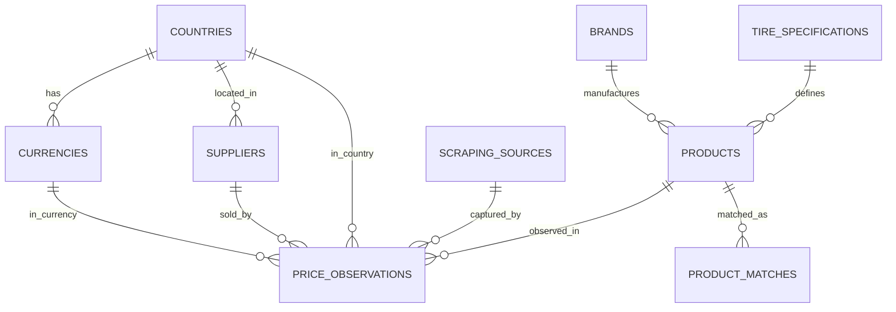

# ADR-002: Database Canonical Model

## Status
Accepted

## Context

Two conflicting database schema documents exist:
- **database-design-v1.md**: Single-tenant model (current, source of truth)
- **discarded-multitenant-model.md**: Multi-tenant model (archived, superseded)

## Decision

**Option A: Adopt database-design-v1.md** - Use as single source of truth. The archived document is explicitly marked as discarded and contains outdated multi-tenant patterns.

## Differences Analysis

### Multi-tenancy (CRITICAL)
| Feature | ddb-v1 | archived | Resolution |
|---------|--------|----------|------------|
| tenant_id on all tables | ❌ | ✅ | **REJECTED** - Archived is obsolete |
| tenants table | ❌ | ✅ | **OMIT** |

### Primary Key Strategy
| Table | ddb-v1 | archived | Resolution |
|-------|--------|----------|------------|
| countries | `id` UUID PK, `code` UNIQUE | `code` CHAR(2) PK | **UUID PK** - More flexible |
| currencies | `id` UUID PK, `country_id` FK | `code` CHAR(3) PK | **UUID PK** - Better relationships |

### Currency-Country Relationship
| Approach | ddb-v1 | archived | Resolution |
|----------|--------|----------|------------|
| currencies has country_id FK | ✅ | ❌ | **ACCEPTED** - Proper normalization |
| countries has currency_code FK | ❌ | ✅ | **REJECTED** - Wrong direction |

### Price History
| Feature | ddb-v1 | archived | Resolution |
|---------|--------|----------|------------|
| price_history table | ❌ (future) | ✅ | **DEFER** - Not MVP |

### Categories
| Feature | ddb-v1 | archived | Resolution |
|---------|--------|----------|------------|
| categories/ltree | ❌ | ✅ | **DEFER** - Not MVP |

## Canonical Entity Model (Adopted from ddb-v1)

## Entity Definitions

| Entity | Fields | Notes |
|--------|--------|-------|
| **countries** | `id` (UUID PK), `code` (VARCHAR(2) UNIQUE), `name`, `locale`, `active`, `created_at` | Reference data |
| **currencies** | `id` (UUID PK), `country_id` (FK), `code` (VARCHAR(3) UNIQUE), `name`, `symbol`, `decimals`, `active`, `created_at` | Reference data |
| **brands** | `id` (UUID PK), `name` (UNIQUE), `normalized_name` (UNIQUE), `country_of_origin`, `active`, `metadata`, `created_at`, `updated_at` | Reference data |
| **tire_specifications** | `id` (UUID PK), `width`, `aspect_ratio`, `rim_diameter`, `load_index`, `speed_index`, `construction`, `run_flat`, `season`, `created_at` | Technical specs |
| **suppliers** | `id` (UUID PK), `name` (UNIQUE), `normalized_name` (UNIQUE), `country_id` (FK), `website`, `active`, `metadata`, `created_at`, `updated_at` | Source entities |
| **scraping_sources** | `id` (UUID PK), `name`, `type`, `config`, `active`, `last_run_at`, `created_at`, `updated_at` | Scraper config |
| **products** | `id` (UUID PK), `fingerprint` (UNIQUE NOT NULL), `sku`, `name`, `normalized_name`, `brand_id` (FK), `tire_specification_id` (FK), `specifications`, `product_type`, `status`, `metadata`, `created_at`, `updated_at` | Core entity with fingerprint |
| **price_observations** | `id` (UUID PK), `product_id` (FK), `supplier_id` (FK), `country_code` (FK), `currency_code` (FK), `price_total`, `observed_at`, `source_url`, `raw_data`, `scraping_run_id`, `created_at` | Price history |
| **product_matches** | `id` (UUID PK), `product_id` (FK), `matched_product_id` (FK), `raw_title`, `fingerprint`, `confidence_score`, `match_type`, `match_status`, `diff_log`, `reviewed_by`, `reviewed_at`, `created_at` | Matching |

## Migration Roadmap

| Step | Entity | Priority |
|------|--------|----------|
| 1 | countries, currencies, brands | Reference data |
| 2 | tire_specifications | Technical data |
| 3 | suppliers | Source entities |
| 4 | scraping_sources | Scraper config |
| 5 | products | Core entity |
| 6 | price_observations | Observations |
| 7 | product_matches | Matching |

## Deferred Features

| Feature | When to add |
|---------|------------|
| price_history | When time-series queries exceed 3s latency |
| categories | When hierarchical product classification needed |

## References
- Source of Truth: `docs/database/database-design-v1.md`
- Archived (superseded): `docs/archive/discarded-multitenant-model.md`