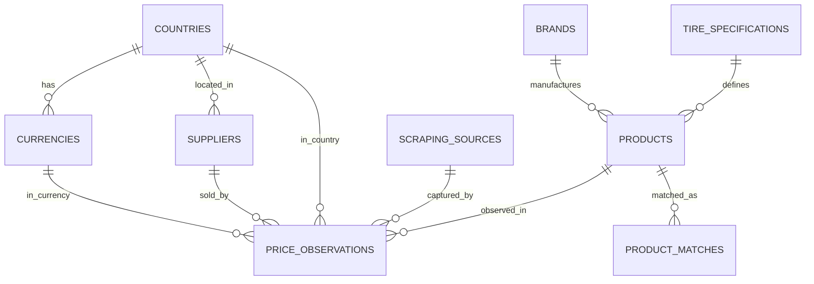

# Canonical Database Model

**Source:** `docs/database/database-design-v1.md`  
**Status:** Approved for Phase 2

## Entity Summary

| Entity | Priority | Dependencies |
|--------|----------|------------|
| countries | P0 - Reference | none |
| currencies | P0 - Reference | countries |
| brands | P0 - Reference | none |
| tire_specifications | P1 - Technical | none |
| suppliers | P1 - Source | countries |
| scraping_sources | P1 - Scraper | none |
| products | P2 - Core | brands, tire_specifications |
| price_observations | P2 - Observations | products, suppliers, countries, currencies, scraping_sources |
| product_matches | P3 - Matching | products |

## ERD



## Table Definitions

### countries
```sql
CREATE TABLE countries (
    id UUID PRIMARY KEY DEFAULT uuid_generate_v4(),
    code VARCHAR(2) UNIQUE NOT NULL,
    name VARCHAR(100) NOT NULL,
    locale VARCHAR(10) DEFAULT 'es-MX',
    active BOOLEAN DEFAULT TRUE,
    created_at TIMESTAMP DEFAULT NOW()
);
```

### currencies
```sql
CREATE TABLE currencies (
    id UUID PRIMARY KEY DEFAULT uuid_generate_v4(),
    country_id UUID REFERENCES countries(id) NOT NULL,
    code VARCHAR(3) UNIQUE NOT NULL,
    name VARCHAR(50) NOT NULL,
    symbol VARCHAR(10),
    decimals SMALLINT DEFAULT 2,
    active BOOLEAN DEFAULT TRUE,
    created_at TIMESTAMP DEFAULT NOW()
);
```

### brands
```sql
CREATE TABLE brands (
    id UUID PRIMARY KEY DEFAULT uuid_generate_v4(),
    name VARCHAR(100) UNIQUE NOT NULL,
    normalized_name VARCHAR(100) UNIQUE NOT NULL,
    country_of_origin VARCHAR(2),
    active BOOLEAN DEFAULT TRUE,
    metadata JSONB DEFAULT '{}',
    created_at TIMESTAMP DEFAULT NOW(),
    updated_at TIMESTAMP DEFAULT NOW()
);
```

### tire_specifications
```sql
CREATE TABLE tire_specifications (
    id UUID PRIMARY KEY DEFAULT uuid_generate_v4(),
    width SMALLINT NOT NULL CHECK (width > 0),
    aspect_ratio SMALLINT NOT NULL CHECK (aspect_ratio > 0),
    rim_diameter SMALLINT NOT NULL CHECK (rim_diameter > 0),
    load_index SMALLINT NULL CHECK (load_index > 0),
    speed_index VARCHAR(10),
    construction VARCHAR(1) DEFAULT 'R',
    run_flat BOOLEAN DEFAULT FALSE,
    season VARCHAR(20),
    created_at TIMESTAMP DEFAULT NOW(),
    UNIQUE (width, aspect_ratio, rim_diameter, load_index, speed_index, construction, run_flat, season)
);
```

### suppliers
```sql
CREATE TABLE suppliers (
    id UUID PRIMARY KEY DEFAULT uuid_generate_v4(),
    name VARCHAR(150) UNIQUE NOT NULL,
    normalized_name VARCHAR(150) UNIQUE NOT NULL,
    country_id UUID REFERENCES countries(id) NOT NULL,
    website VARCHAR(500),
    active BOOLEAN DEFAULT TRUE,
    metadata JSONB DEFAULT '{}',
    created_at TIMESTAMP DEFAULT NOW(),
    updated_at TIMESTAMP DEFAULT NOW()
);
```

### scraping_sources
```sql
CREATE TABLE scraping_sources (
    id UUID PRIMARY KEY DEFAULT uuid_generate_v4(),
    name VARCHAR(100) NOT NULL,
    type VARCHAR(50) CHECK (type IN ('browser_plugin', 'api', 'feed', 'manual')),
    config JSONB NOT NULL DEFAULT '{}',
    active BOOLEAN DEFAULT TRUE,
    last_run_at TIMESTAMP,
    created_at TIMESTAMP DEFAULT NOW(),
    updated_at TIMESTAMP DEFAULT NOW()
);
```

### products
```sql
CREATE TABLE products (
    id UUID PRIMARY KEY DEFAULT uuid_generate_v4(),
    fingerprint VARCHAR(500) UNIQUE NOT NULL,
    sku VARCHAR(255) NOT NULL,
    name VARCHAR(500) NOT NULL,
    normalized_name VARCHAR(500) NOT NULL,
    brand_id UUID REFERENCES brands(id) NOT NULL,
    tire_specification_id UUID REFERENCES tire_specifications(id) NOT NULL,
    specifications JSONB DEFAULT '{}',
    product_type VARCHAR(50) DEFAULT 'tire',
    status VARCHAR(50) DEFAULT 'draft',
    metadata JSONB DEFAULT '{}',
    created_at TIMESTAMP DEFAULT NOW(),
    updated_at TIMESTAMP DEFAULT NOW(),
    CHECK (fingerprint <> '')
);
```

### price_observations
```sql
CREATE TABLE price_observations (
    id UUID PRIMARY KEY DEFAULT uuid_generate_v4(),
    product_id UUID REFERENCES products(id) NOT NULL,
    supplier_id UUID REFERENCES suppliers(id) NOT NULL,
    country_code CHAR(2) REFERENCES countries(code) NOT NULL,
    currency_code CHAR(3) REFERENCES currencies(code) NOT NULL,
    price_total DECIMAL(12,4) NOT NULL CHECK (price_total >= 0),
    observed_at TIMESTAMP WITH TIME ZONE NOT NULL,
    source_url TEXT,
    raw_data JSONB DEFAULT '{}',
    scraping_run_id UUID,
    created_at TIMESTAMP DEFAULT NOW(),
    UNIQUE (product_id, supplier_id, country_code, observed_at)
);
```

### product_matches
```sql
CREATE TABLE product_matches (
    id UUID PRIMARY KEY DEFAULT uuid_generate_v4(),
    product_id UUID REFERENCES products(id) NOT NULL,
    matched_product_id UUID REFERENCES products(id),
    raw_title TEXT NOT NULL,
    fingerprint VARCHAR(500) NOT NULL,
    confidence_score INTEGER NOT NULL,
    match_type VARCHAR(50) NOT NULL,
    match_status VARCHAR(50) NOT NULL,
    diff_log JSONB DEFAULT '[]',
    reviewed_by UUID,
    reviewed_at TIMESTAMP,
    created_at TIMESTAMP DEFAULT NOW()
);
```

## Indexes

```sql
-- products
CREATE UNIQUE INDEX idx_products_fingerprint ON products (fingerprint);
CREATE INDEX idx_products_brand ON products (brand_id);
CREATE INDEX idx_products_status ON products (status);

-- price_observations
CREATE INDEX idx_price_obs_product_country_ts ON price_observations (product_id, country_code, observed_at DESC);
CREATE INDEX idx_price_obs_supplier_ts ON price_observations (supplier_id, observed_at DESC);
CREATE INDEX idx_price_obs_observed ON price_observations (observed_at DESC);

-- tire_specifications
CREATE INDEX idx_tire_spec_compound ON tire_specifications (width, aspect_ratio, rim_diameter);

-- brands
CREATE UNIQUE INDEX idx_brands_normalized_name ON brands (normalized_name);

-- suppliers
CREATE INDEX idx_suppliers_country ON suppliers (country_id);

-- product_matches
CREATE INDEX idx_product_matches_product ON product_matches (product_id);
CREATE INDEX idx_product_matches_status ON product_matches (match_status);
```