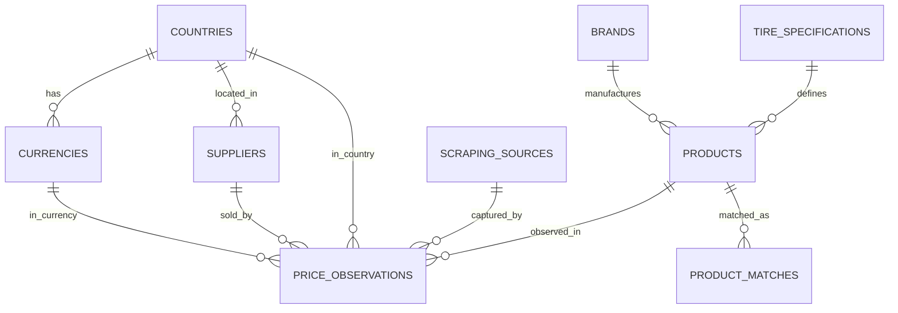

# Database Design v1 - NeumatiQ Next

## ERD Inicial



## Tablas

### countries

| Campo | Tipo | Constraint |
|-------|------|------------|
| id | UUID | PK, default uuid_generate_v4() |
| code | VARCHAR(2) | UNIQUE, NOT NULL |
| name | VARCHAR(100) | NOT NULL |
| locale | VARCHAR(10) | DEFAULT 'es-MX' |
| active | BOOLEAN | DEFAULT TRUE |
| created_at | TIMESTAMP | DEFAULT NOW() |

### currencies

| Campo | Tipo | Constraint |
|-------|------|------------|
| id | UUID | PK, default uuid_generate_v4() |
| country_id | UUID | FK(countries), NOT NULL |
| code | VARCHAR(3) | UNIQUE, NOT NULL |
| name | VARCHAR(50) | NOT NULL |
| symbol | VARCHAR(10) | NULL |
| decimals | SMALLINT | DEFAULT 2 |
| active | BOOLEAN | DEFAULT TRUE |
| created_at | TIMESTAMP | DEFAULT NOW() |

### brands

| Campo | Tipo | Constraint |
|-------|------|------------|
| id | UUID | PK, default uuid_generate_v4() |
| name | VARCHAR(100) | UNIQUE, NOT NULL |
| normalized_name | VARCHAR(100) | UNIQUE, NOT NULL |
| country_of_origin | VARCHAR(2) | NULL |
| active | BOOLEAN | DEFAULT TRUE |
| metadata | JSONB | DEFAULT '{}' |
| created_at | TIMESTAMP | DEFAULT NOW() |
| updated_at | TIMESTAMP | DEFAULT NOW() |

### tire_specifications

| Campo | Tipo | Constraint |
|-------|------|------------|
| id | UUID | PK, default uuid_generate_v4() |
| width | SMALLINT | NOT NULL, CHECK (width > 0) |
| aspect_ratio | SMALLINT | NOT NULL, CHECK (aspect_ratio > 0) |
| rim_diameter | SMALLINT | NOT NULL, CHECK (rim_diameter > 0) |
| load_index | SMALLINT | NULL, CHECK (load_index > 0) |
| speed_index | VARCHAR(10) | NULL |
| construction | VARCHAR(1) | DEFAULT 'R' |
| run_flat | BOOLEAN | DEFAULT FALSE |
| season | VARCHAR(20) | NULL |
| created_at | TIMESTAMP | DEFAULT NOW() |

**Unique constraint:** `(width, aspect_ratio, rim_diameter, load_index, speed_index, construction, run_flat, season)`

### suppliers

| Campo | Tipo | Constraint |
|-------|------|------------|
| id | UUID | PK, default uuid_generate_v4() |
| name | VARCHAR(150) | UNIQUE, NOT NULL |
| normalized_name | VARCHAR(150) | UNIQUE, NOT NULL |
| country_id | UUID | FK(countries), NOT NULL |
| website | VARCHAR(500) | NULL |
| active | BOOLEAN | DEFAULT TRUE |
| metadata | JSONB | DEFAULT '{}' |
| created_at | TIMESTAMP | DEFAULT NOW() |
| updated_at | TIMESTAMP | DEFAULT NOW() |

### scraping_sources

| Campo | Tipo | Constraint |
|-------|------|------------|
| id | UUID | PK, default uuid_generate_v4() |
| name | VARCHAR(100) | NOT NULL |
| type | VARCHAR(50) | CHECK (type IN ('browser_plugin', 'api', 'feed', 'manual')) |
| config | JSONB | NOT NULL DEFAULT '{}' |
| active | BOOLEAN | DEFAULT TRUE |
| last_run_at | TIMESTAMP | NULL |
| created_at | TIMESTAMP | DEFAULT NOW() |
| updated_at | TIMESTAMP | DEFAULT NOW() |

### products

| Campo | Tipo | Constraint |
|-------|------|------------|
| id | UUID | PK, default uuid_generate_v4() |
| fingerprint | VARCHAR(500) | UNIQUE, NOT NULL |
| sku | VARCHAR(255) | NOT NULL |
| name | VARCHAR(500) | NOT NULL |
| normalized_name | VARCHAR(500) | NOT NULL |
| brand_id | UUID | FK(brands), NOT NULL |
| tire_specification_id | UUID | FK(tire_specifications), NOT NULL |
| specifications | JSONB | DEFAULT '{}' |
| product_type | VARCHAR(50) | DEFAULT 'tire' |
| status | VARCHAR(50) | DEFAULT 'draft' |
| metadata | JSONB | DEFAULT '{}' |
| created_at | TIMESTAMP | DEFAULT NOW() |
| updated_at | TIMESTAMP | DEFAULT NOW() |

**Nota:** `products.id` ES el identificador canónico. No existe `canonical_id` separado. No hay FK a `supplier`, `currency` ni `scraping_source`.

### price_observations

| Campo | Tipo | Constraint |
|-------|------|------------|
| id | UUID | PK, default uuid_generate_v4() |
| product_id | UUID | FK(products), NOT NULL |
| supplier_id | UUID | FK(suppliers), NOT NULL |
| country_code | CHAR(2) | FK(countries), NOT NULL |
| currency_code | CHAR(3) | FK(currencies), NOT NULL |
| price_total | DECIMAL(12,4) | NOT NULL, CHECK (price_total >= 0) |
| observed_at | TIMESTAMP WITH TIME ZONE | NOT NULL |
| source_url | TEXT | NULL |
| raw_data | JSONB | DEFAULT '{}' |
| scraping_run_id | UUID | NULL |
| created_at | TIMESTAMP | DEFAULT NOW() |

**Unique constraint:** `(product_id, supplier_id, country_code, observed_at)`

### product_matches

| Campo | Tipo | Constraint |
|-------|------|------------|
| id | UUID | PK, default uuid_generate_v4() |
| product_id | UUID | FK(products), NOT NULL |
| matched_product_id | UUID | FK(products), NULL |
| raw_title | TEXT | NOT NULL |
| fingerprint | VARCHAR(500) | NOT NULL |
| confidence_score | INTEGER | NOT NULL |
| match_type | VARCHAR(50) | NOT NULL |
| match_status | VARCHAR(50) | NOT NULL |
| diff_log | JSONB | DEFAULT '[]' |
| reviewed_by | UUID | NULL |
| reviewed_at | TIMESTAMP | NULL |
| created_at | TIMESTAMP | DEFAULT NOW() |

## Relaciones

| Tabla Origen | Tabla Destino | Cardinalidad | Tipo |
|--------------|---------------|--------------|------|
| countries | currencies | 1 ? N | Referenced |
| countries | suppliers | 1 ? N | Referenced |
| countries | price_observations | 1 ? N | Referenced |
| currencies | price_observations | 1 ? N | Referenced |
| brands | products | 1 ? N | Referenced |
| tire_specifications | products | 1 ? N | Referenced |
| suppliers | price_observations | 1 ? N | Referenced |
| scraping_sources | price_observations | 1 ? N | Referenced |
| products | price_observations | 1 ? N | Parent |
| products | product_matches | 1 ? N | Referenced |
| products | product_matches | 1 ? N | matched_product_id |

## Índices

### products
| Índice | Columnas | Tipo | Justificación |
|--------|----------|------|---------------|
| `idx_products_fingerprint` | fingerprint | UNIQUE B-tree | Matching dedup |
| `idx_products_brand` | brand_id | B-tree | Filtrado por marca |
| `idx_products_status` | status | B-tree | Filtrado por estado |
| `idx_products_search` | name, normalized_name | GIN (gin_trgm_ops) | Búsqueda full-text |

### price_observations
| Índice | Columnas | Tipo | Justificación |
|--------|----------|------|---------------|
| `idx_price_obs_product_country_ts` | (product_id, country_code, observed_at DESC) | B-tree compuesto | Series temporales por producto y país |
| `idx_price_obs_supplier_ts` | (supplier_id, observed_at DESC) | B-tree | Filtrado por proveedor |
| `idx_price_obs_observed` | observed_at DESC | B-tree | Rango de fechas |

### tire_specifications
| Índice | Columnas | Tipo | Justificación |
|--------|----------|------|---------------|
| `idx_tire_spec_compound` | (width, aspect_ratio, rim_diameter) | B-tree compuesto | Búsqueda por medida |

### brands
| Índice | Columnas | Tipo | Justificación |
|--------|----------|------|---------------|
| `idx_brands_normalized_name` | normalized_name | UNIQUE B-tree | Canonicalización de marcas |

### suppliers
| Índice | Columnas | Tipo | Justificación |
|--------|----------|------|---------------|
| `idx_suppliers_country` | country_id | B-tree | Filtrado por país |

### product_matches
| Índice | Columnas | Tipo | Justificación |
|--------|----------|------|---------------|
| `idx_product_matches_product` | product_id | B-tree | Historial por producto |
| `idx_product_matches_status` | match_status | B-tree | Filtrado por estado |

## Constraints

| Tabla | Constraint | Tipo | Justificación |
|-------|------------|------|---------------|
| `price_observations` | `UNIQUE (product_id, supplier_id, country_code, observed_at)` | Unique | Prevenir duplicados de scraping |
| `price_observations` | `CHECK (price_total >= 0)` | Check | Integridad de precios |
| `tire_specifications` | `UNIQUE (width, aspect_ratio, rim_diameter, load_index, speed_index, construction, run_flat, season)` | Unique | Evitar specs duplicadas |
| `products` | `UNIQUE (fingerprint)` | Unique | Identificador canónico del catálogo |
| `products` | `CHECK (fingerprint <> '')` | Check | Fingerprint obligatorio |
| `brands` | `UNIQUE (normalized_name)` | Unique | Diccionario de marcas |
| `suppliers` | `UNIQUE (normalized_name)` | Unique | Evitar proveedores duplicados |
| `countries` | `UNIQUE (code)` | Unique | ISO 3166-1 alpha-2 |
| `currencies` | `UNIQUE (code)` | Unique | ISO 4217 |

## Estrategia de Crecimiento Futura

### price_observations
- **Modelo**: Append-only (solo inserciones)
- **Escala V1**: ~90K registros/mes (~1.1M/año). Tabla plana con índices compuestos.
- **Escala futura**: Si supera 10M de filas, activar particionamiento por RANGE en `observed_at` (documentado en ADR futuro).
- **Retención V1**: Indefinida.
- **Batch inserts**: Agrupar en transacciones de 1000+ filas.

### price_history (futuro)
- No se implementa en V1.
- Se evaluará cuando existan queries de series temporales con latencia > 3s.
- Modelo: agregación diaria desde `price_observations`.

### Escalabilidad estimada

| Volumen | Tabla | Rendimiento esperado |
|---------|-------|---------------------|
| 100K | price_observations | <100ms con índices actuales |
| 1M | price_observations | 100-500ms con índices compuestos |
| 10M+ | price_observations | Requiere particionamiento (ADR futuro) |

## SQL DDL Ejecutable

```sql
-- Extensiones
CREATE EXTENSION IF NOT EXISTS "uuid-ossp";
CREATE EXTENSION IF NOT EXISTS pg_trgm;

-- countries
CREATE TABLE countries (
    id UUID PRIMARY KEY DEFAULT uuid_generate_v4(),
    code VARCHAR(2) UNIQUE NOT NULL,
    name VARCHAR(100) NOT NULL,
    locale VARCHAR(10) DEFAULT 'es-MX',
    active BOOLEAN DEFAULT TRUE,
    created_at TIMESTAMP DEFAULT NOW()
);

-- currencies
CREATE TABLE currencies (
    id UUID PRIMARY KEY DEFAULT uuid_generate_v4(),
    country_id UUID REFERENCES countries(id) NOT NULL,
    code VARCHAR(3) UNIQUE NOT NULL,
    name VARCHAR(50) NOT NULL,
    symbol VARCHAR(10),
    decimals SMALLINT DEFAULT 2,
    active BOOLEAN DEFAULT TRUE,
    created_at TIMESTAMP DEFAULT NOW()
);

-- brands
CREATE TABLE brands (
    id UUID PRIMARY KEY DEFAULT uuid_generate_v4(),
    name VARCHAR(100) UNIQUE NOT NULL,
    normalized_name VARCHAR(100) UNIQUE NOT NULL,
    country_of_origin VARCHAR(2),
    active BOOLEAN DEFAULT TRUE,
    metadata JSONB DEFAULT '{}',
    created_at TIMESTAMP DEFAULT NOW(),
    updated_at TIMESTAMP DEFAULT NOW()
);

-- tire_specifications
CREATE TABLE tire_specifications (
    id UUID PRIMARY KEY DEFAULT uuid_generate_v4(),
    width SMALLINT NOT NULL CHECK (width > 0),
    aspect_ratio SMALLINT NOT NULL CHECK (aspect_ratio > 0),
    rim_diameter SMALLINT NOT NULL CHECK (rim_diameter > 0),
    load_index SMALLINT NULL CHECK (load_index > 0),
    speed_index VARCHAR(10),
    construction VARCHAR(1) DEFAULT 'R',
    run_flat BOOLEAN DEFAULT FALSE,
    season VARCHAR(20),
    created_at TIMESTAMP DEFAULT NOW(),
    UNIQUE (width, aspect_ratio, rim_diameter, load_index, speed_index, construction, run_flat, season)
);

-- suppliers
CREATE TABLE suppliers (
    id UUID PRIMARY KEY DEFAULT uuid_generate_v4(),
    name VARCHAR(150) UNIQUE NOT NULL,
    normalized_name VARCHAR(150) UNIQUE NOT NULL,
    country_id UUID REFERENCES countries(id) NOT NULL,
    website VARCHAR(500),
    active BOOLEAN DEFAULT TRUE,
    metadata JSONB DEFAULT '{}',
    created_at TIMESTAMP DEFAULT NOW(),
    updated_at TIMESTAMP DEFAULT NOW()
);

-- scraping_sources
CREATE TABLE scraping_sources (
    id UUID PRIMARY KEY DEFAULT uuid_generate_v4(),
    name VARCHAR(100) NOT NULL,
    type VARCHAR(50) CHECK (type IN ('browser_plugin', 'api', 'feed', 'manual')),
    config JSONB NOT NULL DEFAULT '{}',
    active BOOLEAN DEFAULT TRUE,
    last_run_at TIMESTAMP,
    created_at TIMESTAMP DEFAULT NOW(),
    updated_at TIMESTAMP DEFAULT NOW()
);

-- products (canonical_id = id)
CREATE TABLE products (
    id UUID PRIMARY KEY DEFAULT uuid_generate_v4(),
    fingerprint VARCHAR(500) UNIQUE NOT NULL,
    sku VARCHAR(255) NOT NULL,
    name VARCHAR(500) NOT NULL,
    normalized_name VARCHAR(500) NOT NULL,
    brand_id UUID REFERENCES brands(id) NOT NULL,
    tire_specification_id UUID REFERENCES tire_specifications(id) NOT NULL,
    specifications JSONB DEFAULT '{}',
    product_type VARCHAR(50) DEFAULT 'tire',
    status VARCHAR(50) DEFAULT 'draft',
    metadata JSONB DEFAULT '{}',
    created_at TIMESTAMP DEFAULT NOW(),
    updated_at TIMESTAMP DEFAULT NOW(),
    CHECK (fingerprint <> '')
);

-- price_observations
CREATE TABLE price_observations (
    id UUID PRIMARY KEY DEFAULT uuid_generate_v4(),
    product_id UUID REFERENCES products(id) NOT NULL,
    supplier_id UUID REFERENCES suppliers(id) NOT NULL,
    country_code CHAR(2) REFERENCES countries(code) NOT NULL,
    currency_code CHAR(3) REFERENCES currencies(code) NOT NULL,
    price_total DECIMAL(12,4) NOT NULL CHECK (price_total >= 0),
    observed_at TIMESTAMP WITH TIME ZONE NOT NULL,
    source_url TEXT,
    raw_data JSONB DEFAULT '{}',
    scraping_run_id UUID,
    created_at TIMESTAMP DEFAULT NOW(),
    UNIQUE (product_id, supplier_id, country_code, observed_at)
);

-- product_matches
CREATE TABLE product_matches (
    id UUID PRIMARY KEY DEFAULT uuid_generate_v4(),
    product_id UUID REFERENCES products(id) NOT NULL,
    matched_product_id UUID REFERENCES products(id),
    raw_title TEXT NOT NULL,
    fingerprint VARCHAR(500) NOT NULL,
    confidence_score INTEGER NOT NULL,
    match_type VARCHAR(50) NOT NULL,
    match_status VARCHAR(50) NOT NULL,
    diff_log JSONB DEFAULT '[]',
    reviewed_by UUID,
    reviewed_at TIMESTAMP,
    created_at TIMESTAMP DEFAULT NOW()
);
```

## Índices DDL

```sql
-- products
CREATE UNIQUE INDEX idx_products_fingerprint ON products (fingerprint);
CREATE INDEX idx_products_brand ON products (brand_id);
CREATE INDEX idx_products_status ON products (status);
CREATE INDEX idx_products_search ON products USING GIN (to_tsvector('spanish', name || ' ' || normalized_name));

-- price_observations
CREATE INDEX idx_price_obs_product_country_ts ON price_observations (product_id, country_code, observed_at DESC);
CREATE INDEX idx_price_obs_supplier_ts ON price_observations (supplier_id, observed_at DESC);
CREATE INDEX idx_price_obs_observed ON price_observations (observed_at DESC);

-- tire_specifications
CREATE INDEX idx_tire_spec_compound ON tire_specifications (width, aspect_ratio, rim_diameter);

-- brands
CREATE UNIQUE INDEX idx_brands_normalized_name ON brands (normalized_name);

-- suppliers
CREATE INDEX idx_suppliers_country ON suppliers (country_id);

-- product_matches
CREATE INDEX idx_product_matches_product ON product_matches (product_id);
CREATE INDEX idx_product_matches_status ON product_matches (match_status);
```
